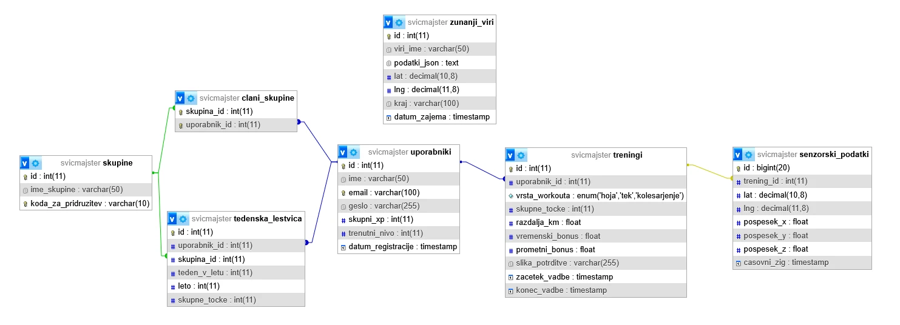

# Idejni načrt za zbiranje in obdelavo podatkov

### Senzorski podatki:

Senzorske podatke pridobimo s pomočjo pospeškometra, GPS-a, in kamere.
Te podatke uporabimo za izračun točk, na primer:
- **Pospeškometer** -> večji šum v pridobljenih podatkih pomeni večjo intenzivnost, kar prinese več točk
- **GPS** -> Večja pretečena razdalja, premagana višinska razlika -> več točk
- **Kamera** -> Uporabnik slika svojo Švic majico, goro katero je preplezal... AI ali glas publike potrdi prisotnost aktivnosti

### Zunanji podatki:

Podatke pridobimo s "strganjem" spleta -> vreme in promet. Te uporabimo za izračun bonusov (npr. 1.5 x točk), s preverjanjem vremenskih razmer, ekstremne razmere prinesejo več točk, ker je uporabnik treniral v težkih pogojih. S preverjanjem prometa preverimo območje treninga, trening v območju z manj izpusti (čist zrak) lahko prinese več točk.

### Primer Podatkovnega modela 




### Backend setup

Inštaliraj pakete

```
npm install
```

Ustvari .env datoteko (Spremeni geslo)

```
DB_USER=SvicMajsterAdmin
DB_PASSWORD=tvoje_geslo
DB_HOST=localhost
DB_PORT=5432
DB_DATABASE=svicmajster
PORT=3000
```

Po zagonu Docker Desktop zaženemo docker-compose.yml file

```
docker-compose up -d
```

Vnos testnih podatkov

```
node seed.js
```

Zagon strežnika

```
npm run dev
```

Preveri delovanje na:

```
http://localhost:3000
http://localhost:3000/api/health
```
